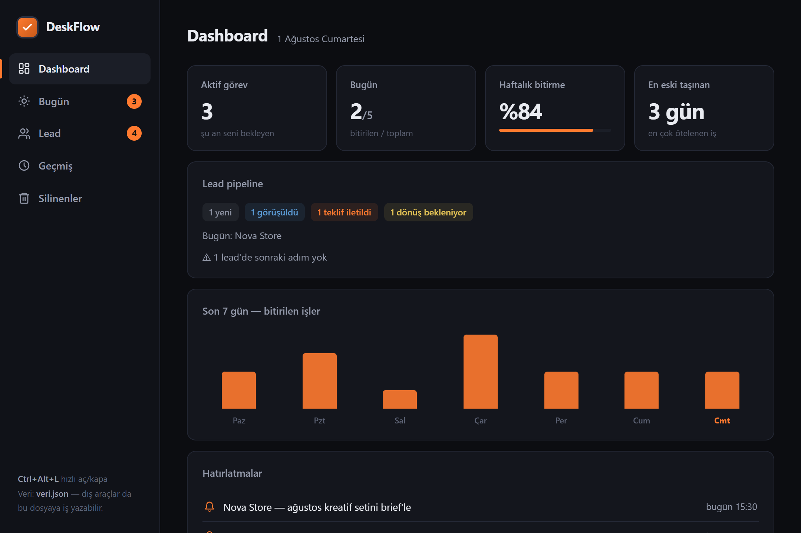
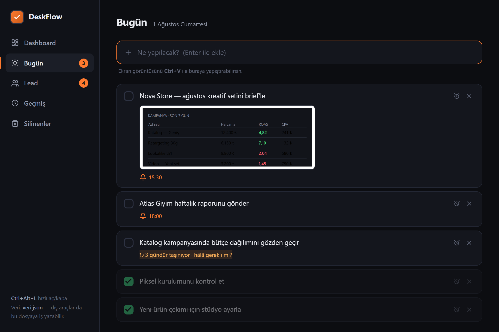
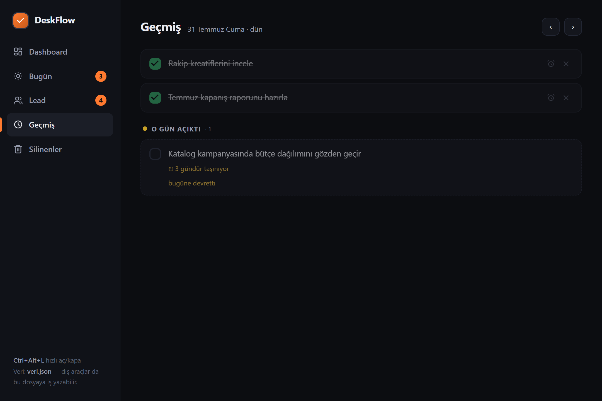
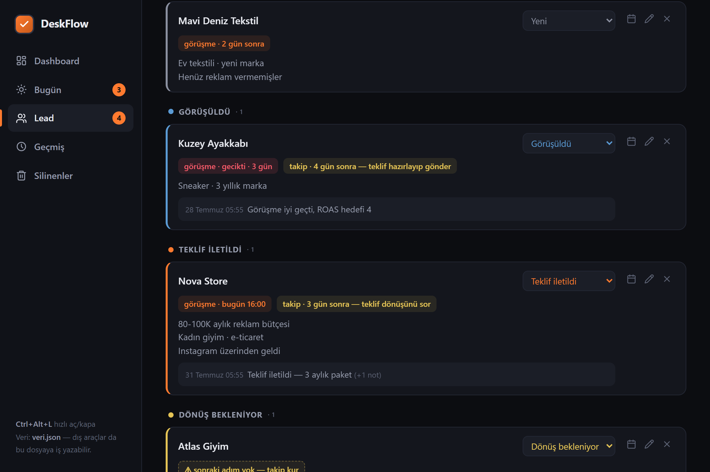

# DeskFlow

Windows için sade, yerel çalışan günlük yapılacaklar + mini lead CRM masaüstü uygulaması. Verin bilgisayarında bir JSON dosyasında durur — hesap yok, bulut yok, abonelik yok.

*A minimal, local-first daily todo + lead CRM desktop app for Windows (Electron). Your data stays in a local JSON file — no account, no cloud.*

<p>
  
  
  
</p>

---

### Dashboard

Günün ve haftanın fotoğrafı: bekleyen iş sayısı, günlük ilerleme, haftalık bitirme yüzdesi, en çok ötelenen iş, lead pipeline özeti ve yaklaşan hatırlatmalar.



### Bugün

Her gün otomatik olarak yeni bir sayfa açılır. Bitmeyen işler ertesi güne kendiliğinden devreder ve kaç gündür ötelendiğini söyler. 3 günü geçen bir iş kendini sorgulatır — *"hâlâ gerekli mi?"* — tıklayınca ya sayacı sıfırlarsın ya da silersin. Ekran görüntüsünü **Ctrl+V** ile doğrudan görevin içine yapıştırabilirsin.



### Geçmiş

Herhangi bir güne dönüp o günün fotoğrafını görürsün: o gün bitirdiklerin ve o gün açık olup sonradan devreden işler ayrı ayrı. Devreden kartlar salt okunurdur — geçmişi yanlışlıkla değiştiremezsin.



### Lead — mini CRM

Görüşmeler aşamalara göre gruplanır: Yeni → Görüşüldü → Teklif iletildi → Dönüş bekleniyor → Satış / Kayıp. Her lead'de bir **sonraki adım** olması beklenir; olmayan lead sarı uyarı alır, böylece hiçbir görüşme sessizce unutulmaz.



---

## Özellikler

- **Günlük sayfa** — her gün sıfırdan başlar; bitmeyen işler devreder, "3 gündür taşınıyor" rozetiyle gözüne batar ve *hâlâ gerekli mi* diye sorar (Bullet Journal'ın "migration" fikri: yeniden yazmaya değmiyorsa muhtemelen o kadar önemli değildir)
- **Geçmiş** — geçmiş günlerin fotoğrafı: o gün ne bitmiş, ne açık kalıp devretmiş
- **Ekran görüntüsü yapıştırma** — Ctrl+V ile görsel doğrudan göreve gömülür
- **Hatırlatmalar** — görev başına tarih/saat; uygulama tepsideyken, pencere kapalıyken bile bildirim düşer
- **Kenar oku** — ekranın kenarında duran ok: tıkla → panel açılır, sürükle → istediğin kenara/monitöre taşı. Kısayol: `Ctrl+Alt+L`
- **Lead CRM** — aşamalı pipeline, görüşmeye 30 dk kala ve tam saatinde bildirim, takip hatırlatıcıları, tarihli not günlüğü
- **Silinenler arşivi** — silinen kayıtlar 30 gün boyunca geri alınabilir
- **Sistem tepsisi** — kapatınca tepsiye küçülür, Windows açılışında sessizce başlar
- **Tamamen çevrimdışı** — hiçbir veri dışarı çıkmaz

## Kurulum

```bash
git clone https://github.com/furkancavlakcom/deskflow.git
cd deskflow
npm install
npm start
```

Gereken: [Node.js](https://nodejs.org) 18+ ve Windows 10/11.

## Veri

Tüm veri uygulama klasöründeki `veri.json` dosyasında tutulur (ilk çalıştırmada oluşur), yapıştırılan görseller `gorseller/` klasörüne kaydedilir. Yedeklemek için bu iki şeyi kopyalaman yeterli.

Dosya biçimi ve dışarıdan (betik, otomasyon, AI asistanı) görev yazma kuralları: [BENIOKU.md](BENIOKU.md). Uygulama dosyayı 1,5 saniyede bir izler — dışarıdan eklenen görev arayüzde anında belirir ve kenar oku parlar.

## Lisans

MIT
